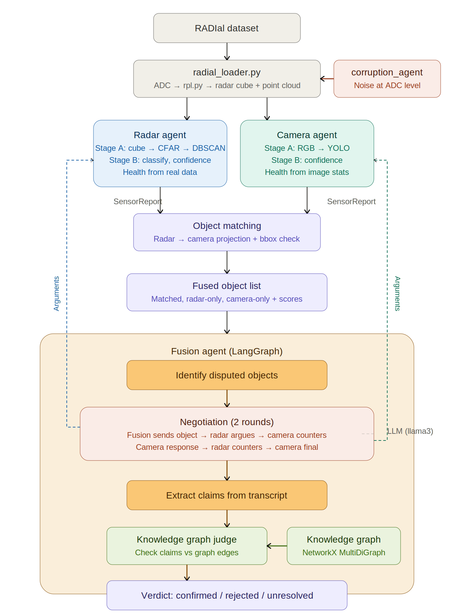

# Multi-Agent Multi-Modal Fusion System

A radar-camera sensor fusion system for autonomous driving perception, built on the [RADIal dataset](https://arxiv.org/abs/2203.06310) (Valeo, CVPR 2022). Two sensor agents independently process raw data, assess their own health, and publish structured reports. A fusion agent reasons over a knowledge graph, performs cross-modal object matching, and runs an LLM-based 2-round negotiation to resolve disputes between sensors.

**Key idea**: the system decides which data sources to combine based on *what is actually available and reliable* — not by choosing a predefined fusion level (early/mid/late). The taxonomy is for human understanding, not the agent's decision space.

---

## Architecture



**Flow:**
1. **RADIal dataset** → `radial_loader.py` reads raw ADC (4 chips), camera MJPEG, and runs rpl.py signal processing → radar cube (512×256×16) + CFAR point cloud per frame
2. **Radar Agent** (`radar_agent.py`) → DBSCAN clustering → object list with position, velocity, motion_state, cluster stats. Health from cube power, detection count, azimuth bias.
3. **Camera Agent** (`camera_agent.py`) → YOLOv8n → bounding box list with class and confidence. Health from brightness and Laplacian CV sharpness.
4. **CrossModalMatcher** (`fused_cross_modal_object_list.py`) → projects radar objects to camera pixels via LiDAR→camera extrinsics, matches at late/mid/early levels, computes fused confidence scores.
5. **Negotiation** (inside CrossModalMatcher) — disputed radar-only objects enter a 2-round LLM debate:
   - Round 1: each agent argues from raw sensor data (cube power, pixel patches)
   - Round 2: counter-argue referencing opponent's data
   - **Judge** (LLM + Knowledge Graph) evaluates per object using:
     - Deterministic raw data summaries (pre-computed from arrays, not agent paraphrases)
     - Active knowledge graph conditions + sensor health
     - 5-step chain-of-thought reasoning
   - Output: `confirmed` (trust radar), `rejected` (trust camera), or `unresolved`
6. **Final output**: fused object list with per-object negotiation verdicts and confidence scores

---

## Pipeline Detail

### 1. Data Loading (`radial_loader.py`)
- Loads one RADIal sequence from disk (4 ADC binary files + MJPEG camera)
- Runs `rpl.py` / `RadarSignalProcessing` for:
  - Deinterleaving ADC → complex I/Q
  - Range-Doppler transform → radar cube (512 range bins × 256 chirps × 16 Rx channels)
  - CFAR detection → point cloud (range, doppler, azimuth, SNR per detection)
- Caches frames for replay (default max 50)
- Labels from `labels_CVPR.csv` are stored as `frame["ground_truth"]` for evaluation **only** — never used as agent input
- Optional `corruption_module` parameter for resilience testing

### 2. Radar Agent (`radar_agent.py`)
**Stage A — Signal Processing:**
- Receives radar cube + CFAR point cloud
- Pre-filters: ego-reflection removal (<7m), FOV limits (±60° azimuth, 100m range)
- DBSCAN clustering (eps=3, min_samples=3) → object list
- Per-object stats: position, velocity, `motion_state` (stationary/moving from doppler), `doppler_std`, `range_spread`, `azimuth_spread_deg`, `n_points`
- **No object classification** — RADIal labels have no object types, only detection quality flags (strong/weak/FP/incomplete)

**Stage B — Health & Confidence:**
- **Interference detection** (combined dynamic + absolute):
  - Dynamic: power ratio vs. adapting memory baseline (catches sudden jumps)
  - Absolute: power ratio vs. static clean baseline from first frame (catches sustained)
  - Final severity = `max(dynamic, absolute)`
- **Misalignment estimation**: stationary-object azimuth bias (EMA α=0.3 across frames)
  - >3° → medium, >6° → high
- Health cascades: cube power + n_detections + interference + misalignment → confidence

### 3. Camera Agent (`camera_agent.py`)
**Stage A — Detection:**
- Receives RGB image (1920×1080)
- YOLOv8n → bounding box list with class labels + confidence scores

**Stage B — Health & Confidence:**
- **Sharpness**: Laplacian CV (std/mean of gradient magnitudes) — robust to both noise and blur
- Relative ratio vs. running baseline from agent memory (no hardcoded thresholds)
- Healthy ~2.1, degraded ~0.6
- Also monitors brightness, motion blur, frame quality

### 4. Cross-Modal Matching (`fused_cross_modal_object_list.py`)
Evidence gathered at three levels per radar object:

| Level | Radar Evidence | Camera Evidence |
|-------|---------------|-----------------|
| **Late** | (via matching) | Projected pixel inside YOLO bbox? |
| **Mid** | DBSCAN cluster density (`n_points / 30`) | Laplacian variance at 32×32 patch |
| **Early** | Cube power ratio (target power / noise floor) | Canny edge density at 48×48 patch |

**Fused confidence** = `mean(all available evidence scores) × min(agent_confidences)`.

### 5. Negotiation (Fusion Agent)
For each radar-only object with a valid pixel projection but no camera bbox match (max 3 per frame for LLM speed):

**Agent `argue()` calls:**
- Both agents receive raw array data (radar: cube power slice + point cloud subset; camera: 16×16 pixel patch)
- They call llama3 with the actual measurements formatted in the prompt
- Output: structured claims + 2-3 sentence argument text with specific numerical values

**Judge (`llm_judge_dispute` in `fusion_knowledge_graph.py`):**
Receives per object:
- Agent text from both rounds (LLM-generated)
- Deterministic raw data summaries:
  - **Radar**: cube peak power, noise floor, active cell count, cluster size, doppler range, SNR range, motion_state
  - **Camera**: grayscale mean/std, Sobel gradient mean/max, BGR center values, edge density
  - **Evidence scores**: point_score, patch_score, cube_power_ratio, edge_density
- Active knowledge graph conditions + sensor health + confidence

**5-step chain-of-thought prompt:**
1. What does radar's RAW DATA show? Reference specific values.
2. What does camera's RAW DATA show? Reference specific values.
3. Which active conditions affect which sensor? (KG DEGRADES edges)
4. Given conditions + health, which is more trustworthy?
5. Verdict: confirmed/rejected/unresolved

---

## Knowledge Graph (`fusion_knowledge_graph.py`)

NetworkX **MultiDiGraph** (supports multiple edges between same node pair).

### Node Types (25 total)
| Type | Count | Examples |
|------|-------|---------|
| Sensor | 2 | `radar`, `camera` |
| Data | 5 | `radar_cube`, `point_cloud`, `radar_object_list`, `rgb_image`, `camera_bboxes` |
| Capability | 6 | `range`, `velocity`, `angle`, `classification`, `depth`, `lateral_position` |
| Condition | 13 | `interference`, `misalignment`, `rain`, `fog`, `night`, `motion_blur`, `radar_blockage`, etc. |

### Edge Types
| Type | Meaning | Example |
|------|---------|---------|
| `PRODUCES` | sensor → first data node | `radar → radar_cube` |
| `DERIVED_FROM` | data → predecessor | `point_cloud ← radar_cube` |
| `PROVIDES` | data → capability (with quality) | `radar_cube → range (high)` |
| `DEGRADES` | condition → data (with severity) | `interference → radar_cube (medium)` |
| `RESISTANT_TO` | sensor → condition | `radar → rain` |
| `COMPENSATES` | cross-sensor compensation | `rgb_image → classification` |

### Condition Cascade
Example: `interference` (high) → `DEGRADES` `radar_cube` → `DERIVED_FROM` propagates to `point_cloud` and `radar_object_list` → capabilities lost → fusion graph queries for compensations.

The graph is queried in two places:
1. **Negotiation judge** — `detect_active_conditions()` maps health fields → active conditions → DEGRADES edges → per-object context
2. **Graph query** — `graph_query.py` traverses the graph for structured reasoning (deterministic, same inputs = same output)

Visualization saved as `fusion_graph.png`.

---

## Corruption Module (`corruption_module.py`)

Plugs into `RadialLoader` to corrupt sensor data at the **earliest stage** (before any processing). Enables end-to-end resilience testing.

### Radar Corruption (applied to raw ADC before rpl.py)

| Mode | Mechanism | Cascade |
|------|-----------|---------|
| `gaussian` | Complex noise added to IQ samples | ADC → cube → CFAR → point cloud → health → confidence |
| `blockage` | Attenuate ADC by factor [0,1] | Same — CFAR is extremely robust (>99% detections at 5% amplitude) |
| `interference` | Linear chirp added to N chirps | Power spikes trigger interference detection → confidence drops to 0.50 |
| `misalignment` | Phase shift across Rx channels (models rotation) | Azimuths shifted → bias detection → >6° → confidence 0.3 |

### Camera Corruption (applied to RGB before YOLO)

| Mode | Mechanism |
|------|-----------|
| `gaussian` | Add Gaussian noise to image |
| `rain` | Albumentations rain effect |
| `fog` | Albumentations fog effect |
| `rain_fog` | Combined rain + fog |

### Usage
```python
cm = CorruptionModule(radar_enabled=0, camera_enabled=0, radar_corruption='misalignment')
loader = RadialLoader(SEQ_PATH, CALIB_PATH, LABELS_PATH, corruption_module=cm)
cm.enable_radar = 1  # toggle mid-run
```

---

## Setup

### Environment
```bash
conda create -n fusion_env python=3.11
conda activate fusion_env
```

### Dependencies
- numpy, scipy, matplotlib, opencv-python
- scikit-learn, albumentations, ultralytics (YOLO)
- langchain, langchain-ollama, langgraph
- networkx
- mkl-fft (for rpl.py radar processing)
- cantools (for CAN bus parsing)

### Ollama
```bash
ollama pull llama3
ollama pull nomic-embed-text
```

### Paths (configurable in scripts)
```python
SEQ_PATH = "/path/to/RECORD@2020-11-21_11.54.31"
CALIB_PATH = "/path/to/CalibrationTable.npy"
LABELS_PATH = "/path/to/labels_CVPR.csv"
CAMERA_CALIB = "/path/to/camera_calib.npy"
```

### Important
```python
os.environ['KMP_DUPLICATE_LIB_OK'] = 'TRUE'  # Required for mkl-fft + numpy
```

---

## How to Run

### Quick Test
```bash
python test_agents.py                      # healthy baseline
python test_agents.py --corrupt            # with corruption module
```

### Scenario Tests
```bash
python run_three.py camera_noise           # camera degraded with Gaussian noise
python run_three.py radar_interference     # radar degraded with interference chirp
```

Expect ~3-5 minutes per scenario (4 agent LLM calls × 30-45s + 3 judge LLM calls × 30s).

---

## Scenario Results

### Camera Noise (Gaussian noise std=80)
- **Camera**: conf=0.31, sharpness=0.6 (motion_blur detected), 0 YOLO detections
- **Radar**: conf=1.00, healthy
- **Negotiation**: all 3 disputes → **confirmed** (trust radar)
- **Judge reasoning**: `cube_peak=1.4e+10` vs `noise_floor=2.9e+07`, `point_score=1.000`, camera `patch_score=0.367`, uniform patch, no edges
- **Result**: Fusion uses radar only

### Radar Interference (chirp power=10.0)
- **Radar**: conf=0.50, interference=high, 676 detections, 32 objects
- **Camera**: conf=1.00, 3 detections, healthy
- **Negotiation**: all 3 disputes → **confirmed** (radar evidence still strong despite degradation)
- **Judge reasoning**: `peak=1.1e+10` vs `noise=3.1e+07`, doppler -1.0mps indicating motion, camera `patch_score=0.079`
- **Result**: Fusion uses camera only (radar degraded for overall strategy)

### Sample Full Negotiation Transcript (Camera Noise Scenario)

3 disputed radar-only objects. Camera degraded (conf=0.31, motion_blur, 0 YOLO detections). Radar healthy (conf=1.00).

```
==================================================
  OBJECT 0
==================================================
  [R1] Radar:  claims={'present': True, 'range_reliable': True, 'velocity_reliable': False, 'class_is_vehicle': None}
    "The strong radar return (peak power: 1.4e+10) and high active cell count (1344/4096) suggest a real object is present at this range. The velocity measurement is unreliable, but the motion state indicates it's stationary."
  [R1] Camera: claims={'present': False, 'class_is_vehicle': None, 'texture_consistent': None}
    "The grayscale patch lacks distinct edges or texture structures, and the Sobel gradient is relatively flat (min=0.0, max=539.2). The BGR color values at center are mixed, but do not form a coherent pattern."
  [R2] Radar:  claims={'present': True, 'range_reliable': True, 'velocity_reliable': False, 'class_is_vehicle': None}
    "Object 0 is present with reliable range measurement of 8.2m, and a high peak power value (1.4e+10) indicating a strong radar return. The noise floor (2.9e+07) is relatively low compared to the peak power, suggesting good signal quality. The Doppler spread is zero, consistent with a stationary object."
  [R2] Camera: claims={'present': False, 'class_is_vehicle': None}
    "Although the radar detected an object at this location, our camera data shows no evidence of a detectable object. The grayscale patch is mostly composed of bright pixels with little to no texture or structure, suggesting noise rather than a real object. The Sobel gradient magnitude is relatively low (min: 0.0, max: 539.2), indicating minimal edge information."

  [Judge] active conditions: {'motion_blur': 'medium'}
    Object 0: verdict=confirmed
    Reasoning: The radar's raw data indicates a strong return with a cube peak of
    1.4e+10, well above the noise floor of 2.9e+07. The cluster size is significant
    at 38 points, suggesting a real object. Additionally, the Doppler spread is zero,
    consistent with a stationary object. In contrast, the camera's raw data shows a
    uniform grayscale patch with low edge density and no distinct texture or structure.

==================================================
  OBJECT 1
==================================================
  [R1] Radar:  claims={'present': True, 'range_reliable': False, 'velocity_reliable': True, 'class_is_vehicle': None}
    "The radar data shows a real object (peak power: 1.1e+10) with a reliable velocity measurement (-1.0mps). However, the range estimate is uncertain due to the relatively low mean cube power (1.7e+08) and high noise floor (3.1e+07)."
  [R1] Camera: claims={'present': False, 'class_is_vehicle': None, 'texture_consistent': None}
    "The Sobel gradient is relatively high (min=0.0, max=510.0), indicating some texture or edge structure. However, the grayscale patch values are not distinct or coherent, and the BGR color values at center do not suggest a vehicle-like appearance."
  [R2] Radar:  claims={'present': True, 'range_reliable': True, 'velocity_reliable': False, 'class_is_vehicle': None}
    "Object 1 is present with reliable range measurement of 8.5m, and a moderate peak power value (1.1e+10) indicating a radar return that is stronger than the noise floor (3.1e+07). The Doppler spread (-1.0mps) indicates motion away from the sensor, but the signal quality is sufficient to identify the object as present."
  [R2] Camera: claims={'present': False, 'class_is_vehicle': None}
    "Similar to Object 0, our camera data does not support the presence of an object at this location. The grayscale patch has a mixture of bright and dark pixels with no clear texture or structure, suggesting clutter rather than a real object."

  [Judge] active conditions: {'motion_blur': 'medium'}
    Object 1: verdict=confirmed
    Reasoning: Based on the radar's RAW DATA, I find that the cube peak is well
    above the noise floor (peak: 1.1e+10, noise floor: 3.1e+07), indicating a
    strong and reliable signal. The cluster size of 44 points suggests a consistent
    object signature. Dopplers are moderate (-1.0mps) but do not contradict the
    object's presence. With high point_score (1.000) and cube_power_ratio (1.000),
    I trust radar's evidence. Camera's RAW DATA shows a uniform grayscale patch
    with no clear edge structure or texture, patch_score (0.367) and
    edge_density (0.367).

==================================================
  OBJECT 17
==================================================
  [R1] Radar:  claims={'present': True, 'range_reliable': True, 'velocity_reliable': False, 'class_is_vehicle': None}
    "The strong radar return (peak power: 1.6e+10) and low noise floor (1.7e+08) indicate a real object is present at this range. The velocity measurement is unreliable, but the motion state indicates it's stationary."
  [R1] Camera: claims={'present': False, 'class_is_vehicle': None, 'texture_consistent': None}
    "The grayscale patch lacks distinct edges or texture structures, and the Sobel gradient is relatively low (min=0.0, max=470.0). The BGR color values at center are not coherent or vehicle-like."
  [R2] Radar:  claims={'present': True, 'range_reliable': True, 'velocity_reliable': False, 'class_is_vehicle': None}
    "Object 17 is present with reliable range measurement of 35.0m, and a high peak power value (1.6e+10) indicating a strong radar return. The noise floor (1.7e+08) is relatively low compared to the peak power, suggesting good signal quality."
  [R2] Camera: claims={'present': False}
    "Our camera data indicates that this location may be contaminated with noise or shadow, as the grayscale patch has a mix of dark and bright pixels with no clear structure. The Sobel gradient magnitude is relatively low (min: 0.0, max: 470.0), suggesting little to no edge information."

  [Judge] active conditions: {'motion_blur': 'medium'}
    Object 17: verdict=confirmed
    Reasoning: The radar's raw data shows a high cube peak of 1.6e+10, well above
    the noise floor of 1.7e+08. The point_score and cube_power_ratio both indicate
    strong evidence for this object. Camera's raw data lacks distinct edge structure
    (sobel_mean) and has uniform grayscale values (gray_std). Camera confidence is
    low due to motion blur. Radar's evidence is more trustworthy.
```

Each disputed object shows Round 1 (initial argument), Round 2 (counter-argument), and the judge verdict with chain-of-thought reasoning referencing specific values from the deterministic raw data section. In this scenario, all 3 were **confirmed** (trust radar) because the camera was degraded by noise while radar remained healthy.

---

## File Map

### Active
| File | Purpose |
|------|---------|
| `radial_loader.py` | Load RADIal sequence, run radar signal processing, cache frames |
| `radar_agent.py` | Radar perception: CFAR → DBSCAN → object list + health + confidence |
| `camera_agent.py` | Camera perception: YOLOv8 → bounding boxes + health + confidence |
| `fusion_knowledge_graph.py` | NetworkX MultiDiGraph: sensors, data, capabilities, conditions |
| `graph_query.py` | Knowledge graph traversal given sensor health |
| `corruption_module.py` | Sensor corruption for resilience testing |
| `fused_cross_modal_object_list.py` | Cross-modal matching + evidence scoring + negotiation + judge |
| `run_three.py` | Scenario test script (camera_noise, radar_interference) |
| `test_agents.py` | Agent verification with optional corruption |
| `labels_CVPR.csv` | Ground truth (evaluation only) |
| `multiagent_fusion_architecture.png` | Architecture diagram |

### Legacy (reference, not part of current architecture)
- `build_knowledge_base.py` — old ChromaDB RAG
- `fusion_graph.py` — old LangGraph experimentation
- `orchestrator_agent.py` — old rule-based orchestrator
- `radar_agent_stub.py` / `camera_agent_stub.py` — old hardcoded stubs

### Output Files (generated at runtime)
- `fused_*.png` — detection visualizations per scenario
- `negotiation_report_*.txt` — negotiation transcripts
- `fusion_graph.png` — KG visualization

---

## Known Limitations

- **Concede mechanism not implemented** — both agents always contest every disputed object, even when their evidence is weak
- **Camera mid-level** — no CNN feature maps; camera only has early (RGB) and late (YOLO bboxes)
- **Radar has no object classification** — RADIal labels have no object types. Only motion_state (stationary/moving) and cluster stats
- **DBSCAN tuning** produces ~32 clusters per frame (many static objects like parked cars, buildings)
- **Health metric conflates noise and blur** — Laplacian CV drops for both, triggering `motion_blur` for either. Safe but semantically incorrect
- **Radar velocity conversion** uses bin-centered approximation (needs exact chirp parameters)
- **llama3 (8B)** is unreliable for consistent agent reasoning. Prototype limitation
- **Radar-only objects under radar degradation** — no third sensor to cross-reference, judge flips between confirmed/rejected run-to-run
- **Extract + fuse** — the system decides which sources to use but doesn't actually combine the data yet
- **Some health fields are stubbed** — `calibration_valid` (always True), `hw_error` (always False), `occlusion_level` (always "low")

---

## Next Steps

- Concede mechanism — agents that lack evidence concede disputed objects
- Safety agent — veto power over negotiation verdicts with certifiable rules
- Adversarial agent — systematic corruption scenario generation
- Extract + fuse nodes — actually combine sensor data based on fusion decisions
- Upgrade model (llama3.1:70B or API) for more reliable reasoning

---

## Critical Technical Details

- **ADC data**: 1,048,576 int16 per chip, interleaved I/Q → complex → (512,256,16) cube (Fortran, 4 chips on rx axis). Global Rx order: `[chip3, chip0, chip1, chip2]`
- **Camera calib**: LiDAR-to-camera extrinsics from `camera_calib.npy`. Projection: `cv2.projectPoints([-y_m, x_m, 0.5], ...)`
- **Labels**: `labels_CVPR.csv` with detection quality flags (strong/weak/FP/incomplete) — **not object classes**
- **Labels coordinate convention**: `radar_X_m` = lateral, `radar_Y_m` = longitudinal (swapped vs DBSCAN's x=forward, y=lateral)
